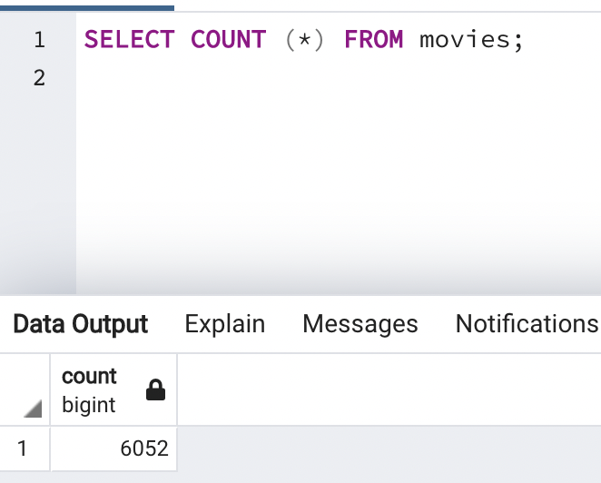
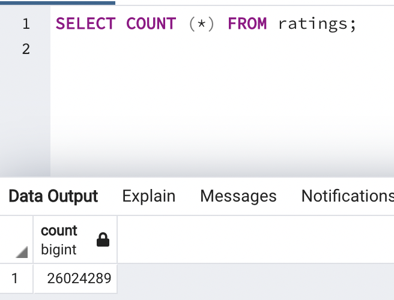

# Movies-ETL
## Overview
Amazing Prime is a large online retailor for streaming movies. They want to sponser a "Hackathon" where they will share a large and clean dataset containing film data from Wikipedia and Kaggle, and ratings data from MovieLand's website. Britta, an employee at the company, needs help in merging datasets in order to provide "Hackers" the most recent film data. This process can be completed with the use of ETL (Extract, Transfrom, Load), Pandas, Jupyter Notebook and a SQL database. 

The purpose of this assignment create a function that will read in three separate data files: wikipedia-movies.json (Wikipedia), movies_metadata.csv (Kaggle), and the ratings.csv (MovieLand). Python and Pandas will allow us to gather data from multiple sources in the Extract phase, which will then be cleaned. The Transform step filters in necessary data and filters out data surplus to requirments. Finally, the transformed data will be loaded into a SQL database (pgAdmin 4 and Postgres) where we can visualize the results for the attendees at the Amazing Prime Hackathon.   

## Results 
### ETL Function for Reading the Three Data Files
First, the three data files must be read in order to extract the data into one location. 
'''
extract_transform_load()
'''
This function contains two pd.read_csv statements for the Kaggle CSV file and MovieLand ratings CSV file, and a json.load() function to read the Wikipedia data. Once the data is extracted using code mentioned before, the data can be visualized before the Transform step using Pandas dataframes revealing how large the datasets are, the column headers, and the number of rows of data. 

### Extract and Transform the Wikipedia Data
This goal of this part of the analysis is the prepare for the merging of the Wikipedia dataset with the Kaggle metadata. Before we can combine these datasets there must be a degree of filtering on the Wikipedia set in order to remove excess columns. Using functions, columns with alternate languages can be dropped are kept depending on their presence. Column names are changed in order to make the data tables easier to read. Regular Expressions are used in order to locate specific data structures. During the analysis, currency is listed in multiple styles and the regular expressions are placed into a funtion in order to loop through the data and change different styles into one uniform style. 

### Extract and Transform the Kaggle Data
The Kaggle metadata needs to be cleansed like the Wikipedia data before it, so they can be merged together. In order to execute this step, column headers need their data type to be changed in order to send them into the SQL database. Once the columns are cleaned we can fill the missing data from the Kaggle set and the Wikipedia and Kaggle data frames can be merged and named "movies_df". Then we merge the ratings data into our new movies_df and match each rating with each movie with their movie ID. 

### Create the Movie Database
The final step in the analysis is to load the data into an SQL database. We can accomplish this by linking Jupyter Notebook to pgAdmin 4 by connecting through the local server. After inputting the correct path we can create the movies' table and rating's table, as well as inputting all of our data from the previous step. 

